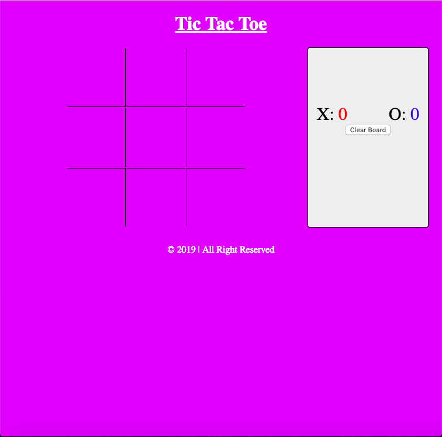
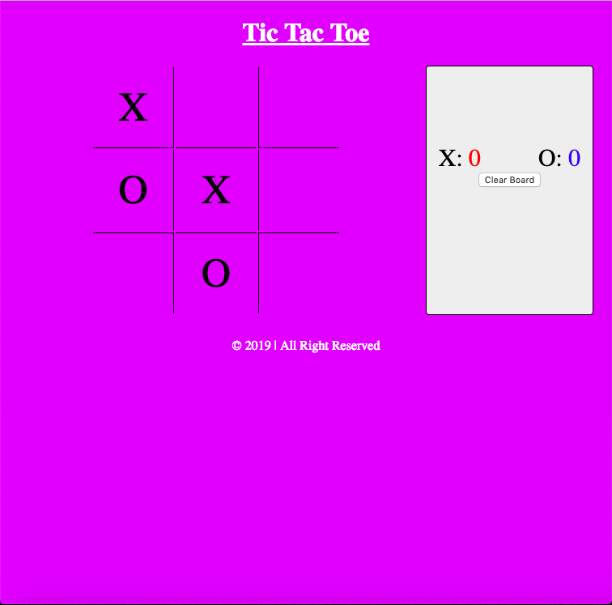
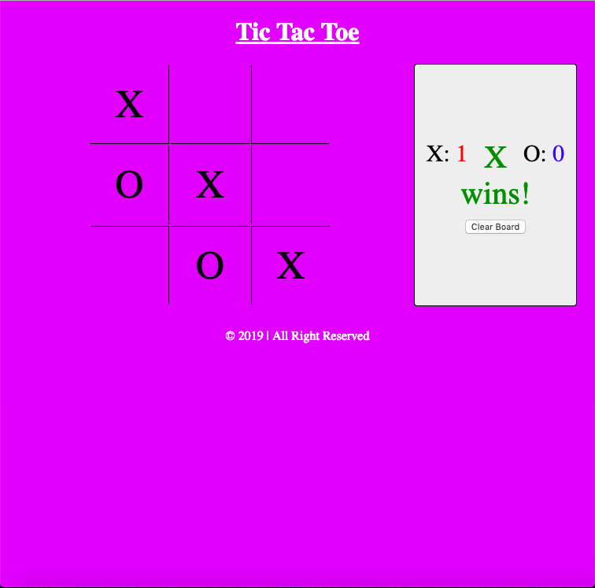
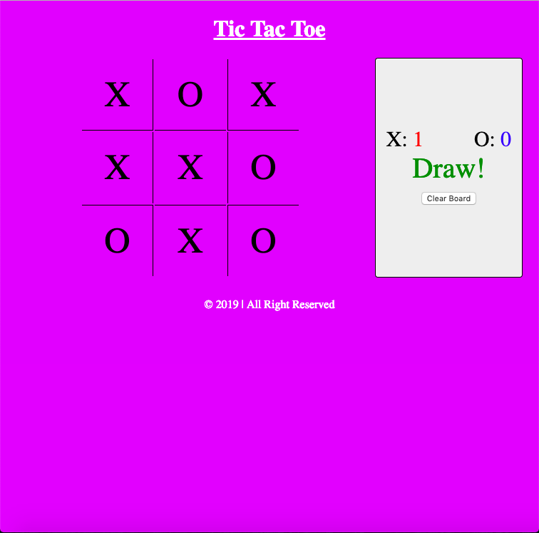
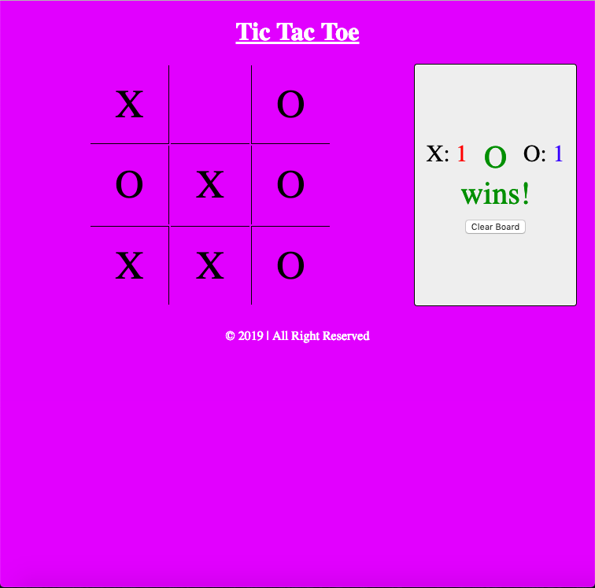

# Tic Tac Toe

### How to start
> 1. To open the app go to the project's download folder
> 2. Right click on the file name _index.html_
> 3. Click on the _open with_ option
> 4. Chose a browser to use the app in

### How to use
> 1. Take turns click the board to place an X or an O
> 2. Whoever gets 3 symbols in a row (horizontally, vertically or diagonally) wins
> 3. Press the _Clear Board_ button to reset the board

### Requirements
- This game requires a browser to run
- The browser needs to have Javascipt available and enabled

### Preview

**Thank you for downloading this project :)**